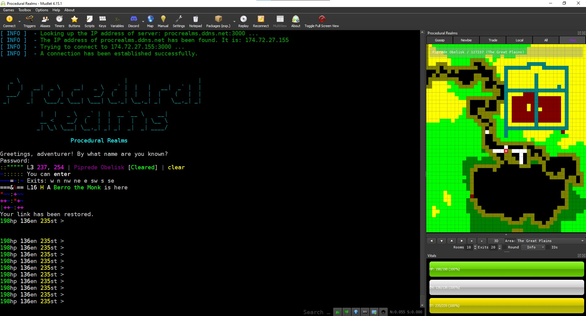
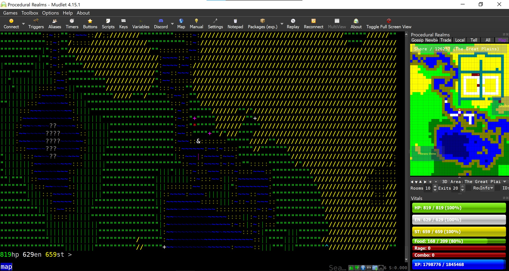

# Procedural Realms Script

<!-- PROJECT BANNER -->
<div>
    <br />
    <p align="center">
        <a href=".github/images/procrealms-mudlet-alt-4x.png">
          
        </a>
    </p>  
</div>


<!-- PROJECT BADGES -->
[](https://github.com/iLPdev/prs/releases/latest) <!-- ALL-CONTRIBUTORS-BADGE:START - Do not remove or modify this section --> [](#contributors-) <!-- ALL-CONTRIBUTORS-BADGE:END --> [![Issues][issues-shield]][issues-url] [![GPL License][license-shield]][license-url] [![standard-readme compliant][standard-readme-shield]][standard-readme-url]
[](https://github.com/Mudlet/Mudlet/releases/latest)

<!-- SHORT DESCRIPTION -->
<p align="center">
    Mudlet script for Procedural Realms MUD
    <br />
</p>

<!-- LONG DESCRIPTION --> 
The Procedural Realms Script [PRS] project gives [Procedural Realms MUD](http://textdimension.com/) players improved access to the advanced features of the [Mudlet](https://www.mudlet.org) MUD client. By leveraging the specific "out of band" packets sent by Procedural Realms' server, PRS correcly identifies rooms, stops creation of duplicate rooms, and accurately tracks your character's location on the map as you move about the realm. Additional convenience features include autosetting terrain colors, self-updating gauges for vitals, chat containers, and adjustable UI layout.

Project Link: [https://github.com/iLPdev/prs]<br />
Mudlet Forum Topic: [https://forums.mudlet.org/viewtopic.php?f=6&t=23126]


<!-- TABLE OF CONTENTS -->
## Table of Contents

- [Background](#background)
- [Install](#install)
- [Roadmap](#roadmap) 
- [Maintainer](#maintainer)
- [Acknowledgements](#acknowledgements)
- [Contributing](#contributing)
- [License](#license)
 
<!-- ABOUT THE PROJECT -->
## Background

<p align="center">
    <a href="prs-screenshot-01.jpg" alt="" title="Piprede Obelisk"></a> <a href="prs-screenshot-02.jpg" alt="" title="EMCO Chat"></a>
</p>

### History

#### Milestones

- v0.12.0 - Mini-map Congruence Achieved
- v0.5.0 - Begin package installation development
- v0.1.2 - Fixed exitstub tracking
- v0.2.1 - Fixed speedwalk

<!-- ### Vision

As complement to a planned Mudlet UI for Discworld MUD, the aim of this project is to provide existing and potential players with a newbie-friendly (accessible) and reliable means to map and navigate the Discworld MUD in an elegeant, modern MUD client. In line with that aim, the goal of this project is to release a Mudlet package with all the requisite aliases, triggers, and scripts. Ultimately, my hope is that discMapper might become a part of a larger Mudlet package for Discworld MUD, including guild-specific UI feature setss. -->

### Features

- Automatic GMCP mapping of Procedural Realms MUD
- Automatic GMCP room styling based on terrain.
  - Matches colors in PR's 'map' and 'look' quickmap.
- Tabbed Chat -- Adjustable, dockable, resizable, and no conversations lost in scroll!
- Self-updating gauges for charcater vitals, including Hit Points, Energy, Stamina, and eXperience Points.
- Speedwalking and pathfinding - Efficiently get where you're going - and fast!

### Built With

- [Lua](https://www.lua.org) is the programming language
- [Edbee Library](https://github.com/edbee/edbee-lib) provides the text editor component for Mudlet
- [Mudlet](https://github.com/Mudlet/Mudlet) is a cross-platform, open source, and super fast MUD client
- [MDK](https://github.com/demonnic/MDK) is a collection of Lua 'classes' and modules by @demonnic
- [Git](https://git-scm.com) is the version-control system for tracking changes and project management
- [ImgBot](https://github.com/dabutvin/Imgbot) provides GitHub-integrated image optimization

### Versioning

Version numbering approximates the [Semantic Versioning](http://semver.org) approach.

### Project Status
<!-- Describe the current release and any notes about the current state of the project. Examples: currently compiles on your host machine, but is not cross-compiling for ARM, APIs are not set, feature not implemented, etc. -->

[![Status Ventis][status-ventis]][andivionian-status-classifier] 

- **Project State**: Procedural Realms Script is under active development. The application can be used, but may be unstable. We are in need of beta testing prior to moving forward with the v1.0.0 release.

- **Current Release**: v0.12.0

**[^Top](#table-of-contents)**

<!-- GETTING STARTED -->
## Install

The [Mudlet Makers](https://github.com/Mudlet/Mudlet/graphs/contributors) could not have made it easier to install preconfigured custom aliases, triggers, scripts, keybindings, and UIs.

<!-- ### One-Click Install Method

Copy/paste the following command into Mudlet's input line to install discMapper:

```lua
lua function d(a,b)if not b:find("oci",1,true)then return end installPackage(b)os.remove(b)cecho("<lime_green>PRS package installed!\n")end registerAnonymousEventHandler("sysDownloadDone","d")downloadFile(getMudletHomeDir().."/oci.mpackage","https://github.com/iLPdev/prs/releases/download/v0.7.1/PRS.mpackage")
```
-->

### Package Install Method

Just like any other package as of Mudlet v4.8+, you may install PRS by simply dragging and droppping the package file into Mudlet. discMapper will then be merged into your active Mudlet profile, and you may delete the original file.

To install PRS, just follow these steps:

1. Locate the [latest release](https://github.com/iLPdev/prs/releases/latest) of PRS.
1. Download the .mpackage file listed under Assets.
1. Open Mudlet on your operating system of choice.
1. Open an existing Procedural Realms MUD profile or create a new one.
1. Locate the saved file on your PC.
1. Drag and drop the file into your open Procedural Realms MUD profile.
1. Optionally, delete the .mpackage file from your computer.

### Dependencies

<a href="https://www.mudlet.org"></a>

- [MDK](https://github.com/demonnic/MDK) provides EMCO and SUG support.
- [Mudlet][mudlet-url] MUD Client application must obviously be installed on your operating system (Windows, MacOS, and Linux)

### Getting the Source

The PRS project is [hosted on GitHub](https://github.com/iLPdev/prs). All versions of the repository are available as [releases](https://github.com/iLPdev/prs/releases).

You can also clone the entire project directly with this command: `git clone git@github.com:iLPdev/prs.git`

**[^Top](#table-of-contents)**

<!-- ROADMAP -->
## Roadmap

The primary objective is to develop and test a minimally viable package for Mudlet that meets the requirements for includion on the list of connectable games when Mudlet starts and, in turn, to increase the playerbase of Procedural Realms.

Planned new features include:

See also the [open issues](https://github.com/iLPdev/prs/issues) for a list of proposed features (and known issues).

**[^Top](#table-of-contents)**

<!-- MAINTAINER(S) -->
## Maintainer

[@Stack](https://github.com/iLPdev) - Stop by and say hello on the [Mudlet Discord Server](https://discordapp.com/invite/kuYvMQ9)!

**[^Top](#table-of-contents)**

<!-- ACKNOWLEDGEMENTS -->
## Acknowledgements

<!-- State anyone or anything that significantly helped with the development of your project.
     State public contact hyper-links if applicable. -->

- [@demonnic](https://github.com/demonnic) for his seemingly indefatigable patience and help.
- [@halimcme](https://github.com/halimcme) (Blizzard) for his [Simple GMCP Mapper](https://github.com/halimcme/worldofpain/blob/master/mapping.lua) script and responsiveness to all my questions.
- `README.md`:
  - [Best-README-Template](https://github.com/othneildrew/Best-README-Template) for initial inspiration
  - [Standard Readme](https://github.com/RichardLitt/standard-readme) specifcation
  - [Shields.io](https://shields.io/) for serving badges

**[^Top](#table-of-contents)**

<!-- CONTRIBUTING -->
## Contributing

Contributions are what make the open source community such an amazing space to be learn, inspire, and create. Any contributions you make are **greatly appreciated** -- that’s the main reason discMapper is open-sourced! There are so many ways to contribute, even if you’re not a technical person. All contributions--no matter how small---are always welcome. 

See the [open issues](https://github.com/iLPdev/prs/issues) for a list of ideas, questions, proposed features, and known issues.

There is not an explicit workflow requirement for this project, yet. I'm currently exprimenting with the [Gitflow](https://nvie.com/posts/a-successful-git-branching-model/) approach and [Conventional Commits](https://www.conventionalcommits.org/), but you don't need to.

Basically, to contribute to this project, you're invited to:

1. Create an Issue (bug report / feature request)
1. Fork the Repository
1. Create your Branch (optionally reference issue in branch name; `git checkout -b feature/AmazingFeature`)
1. Code Code Code
1. Commit your Changes (incrementally with detailed commit messages; `git commit -m 'Add some AmazingFeature'`)
1. Push to your Branch (`git push origin feature/AmazingFeature`)
1. Submit a Pull Request

### Ethics

[](CODE_OF_CONDUCT.md)

This project follows the [Contributor Covenant Code of Conduct](CODE_OF_CONDUCT.md) and operates under the W3C's [Code of Ethics and Professional Conduct](https://www.w3.org/Consortium/cepc):

> W3C is a growing and global community where participants choose to work
> together, and in that process experience differences in language, location,
> nationality, and experience. In such a diverse environment, misunderstandings
> and disagreements happen, which in most cases can be resolved informally. In
> rare cases, however, behavior can intimidate, harass, or otherwise disrupt one
> or more people in the community, which W3C will not tolerate.
>
> A Code of Ethics and Professional Conduct is useful to define accepted and
> acceptable behaviors and to promote high standards of professional
> practice. It also provides a benchmark for self evaluation and acts as a
> vehicle for better identity of the organization.

The expectation is that our community group acts according to these guidelines, and that participants hold each other to these high standards. If you have any questions or are worried that the code isn't being followed, please contact the [maintainer](#maintainer) of this repository.

## Contributors

Thanks go to these amazing folks ([emoji key](https://allcontributors.org/docs/en/emoji-key)):

<!-- ALL-CONTRIBUTORS-LIST:START - Do not remove or modify this section -->
<!-- prettier-ignore-start -->
<!-- markdownlint-disable -->
<table>
  <tr>
    <td align="center"><a href="https://soundcloud.com/phortran"><br /><sub><b>Tom Dinchak</b></sub></a><br /><a href="https://github.com/iLPdev/prs/commits?author=dinchak" title="Code">💻</a> <a href="#ideas-dinchak" title="Ideas, Planning, & Feedback">🤔</a></td>
    <td align="center"><a href="https://github.com/iLPdev"><br /><sub><b>iLPdev</b></sub></a><br /><a href="https://github.com/iLPdev/prs/commits?author=iLPdev" title="Code">💻</a> <a href="https://github.com/iLPdev/prs/commits?author=iLPdev" title="Documentation">📖</a> <a href="#design-iLPdev" title="Design">🎨</a> <a href="#ideas-iLPdev" title="Ideas, Planning, & Feedback">🤔</a> <a href="#maintenance-iLPdev" title="Maintenance">🚧</a> <a href="#projectManagement-iLPdev" title="Project Management">📆</a> <a href="https://github.com/iLPdev/prs/pulls?q=is%3Apr+reviewed-by%3AiLPdev" title="Reviewed Pull Requests">👀</a> <a href="https://github.com/iLPdev/prs/commits?author=iLPdev" title="Tests">⚠️</a> <a href="#infra-iLPdev" title="Infrastructure (Hosting, Build-Tools, etc)">🚇</a></td>
  </tr>
</table>

<!-- markdownlint-restore -->
<!-- prettier-ignore-end -->

<!-- ALL-CONTRIBUTORS-LIST:END -->

**[^Top](#table-of-contents)**

<!-- LICENSE -- Must be last section. -->
## License

Copyleft (2022) _iLP development_. Distributed under GPL v3.0-and-later. For more
information, see [`LICENSE`](https://github.com/iLPdev/prs/blob/main/LICENSE).

**[^Top](#table-of-contents)**

<!-- MARKDOWN LINKS & IMAGES -->
<!-- https://www.markdownguide.org/basic-syntax/#reference-style-links -->
[contributors-shield]: https://img.shields.io/github/contributors/iLPdev/prs.svg?style=flat-square
[contributors-url]: https://github.com/iLPdev/prs/graphs/contributors
[forks-shield]: https://img.shields.io/github/forks/iLPdev/prs.svg?style=flat-square
[forks-url]: https://github.com/iLPdev/prs/network/members
[stars-shield]: https://img.shields.io/github/stars/iLPdev/prs.svg?style=flat-square
[stars-url]: https://github.com/iLPdev/prsstargazers
[issues-shield]: https://img.shields.io/github/issues/iLPdev/prs.svg?style=flat-square
[issues-url]: https://github.com/iLPdev/prs/issues
[license-shield]: https://img.shields.io/github/license/iLPdev/prs.svg?style=flat-square
[license-url]: https://github.com/iLPdev/prs/blob/master/LICENSE.txt
[standard-readme-shield]: https://img.shields.io/badge/readme%20style-standard-brightgreen.svg?style=flat-square
[standard-readme-url]: https://github.com/RichardLitt/standard-readme
[andivionian-status-classifier]: https://github.com/ForNeVeR/andivionian-status-classifier#status-ventis-
[status-ventis]: https://img.shields.io/badge/status-ventis-yellow.svg
[mudlet-url]: https://www.mudlet.org
[ac-url]: https://github.com/all-contributors/all-contributors
