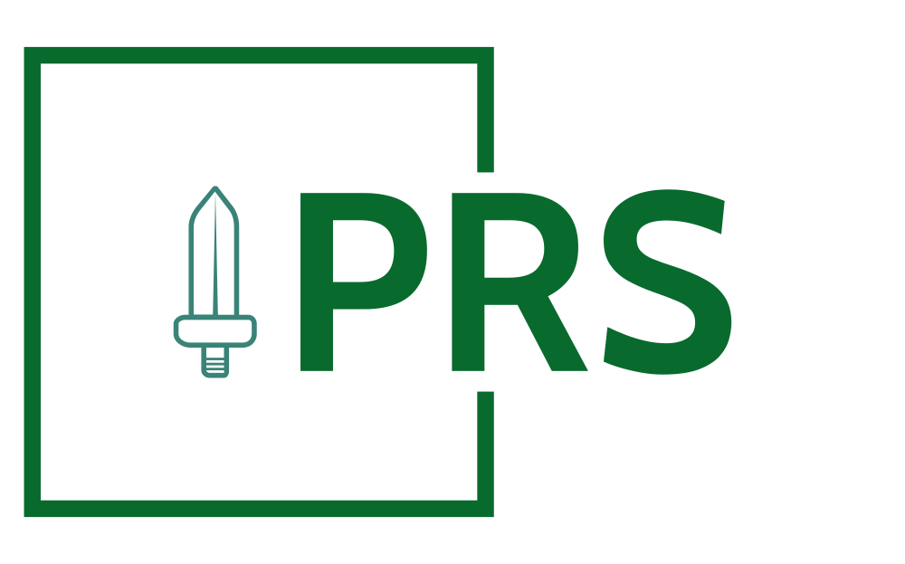
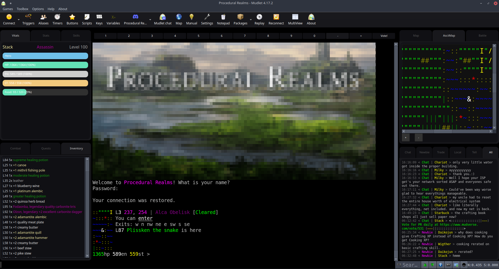
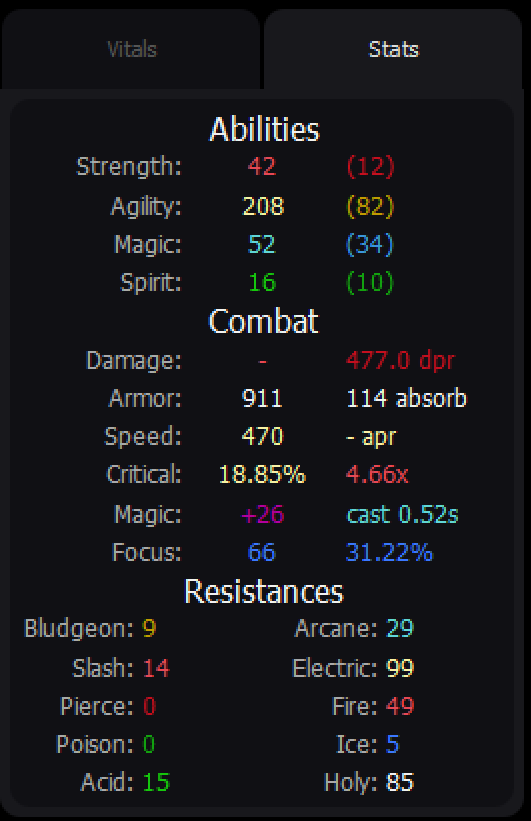
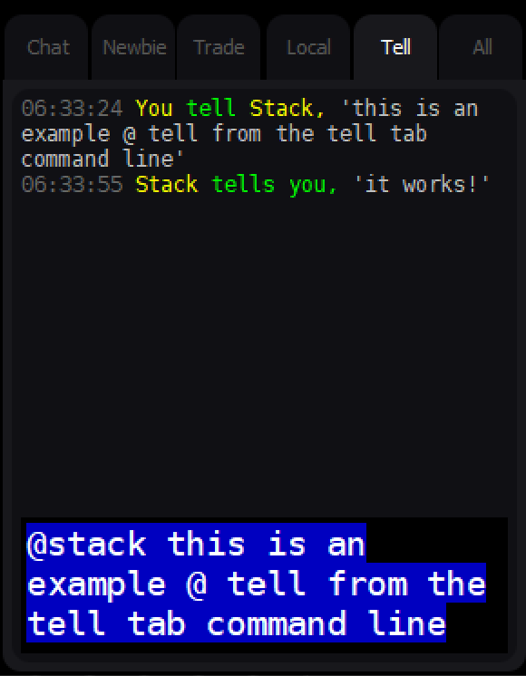
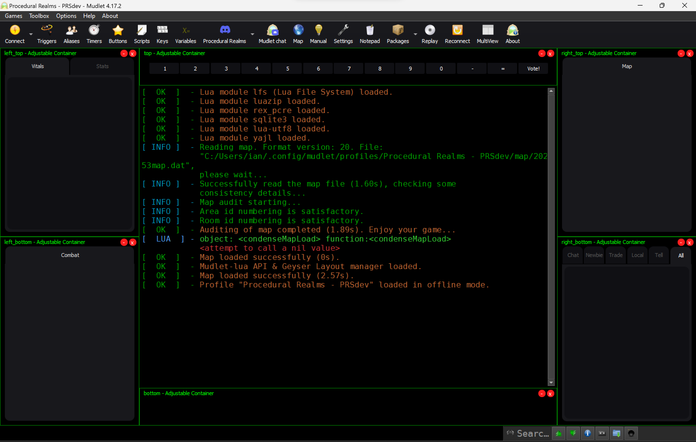

# Procedural Realms Script

<!-- PROJECT BANNER -->

     
    

        
    
  

<!-- PROJECT BADGES -->

 [![Issues][issues-shield]][issues-url] ![Downloads][downloads-shield] [![GPL License][license-shield]][license-url] [![standard-readme compliant][standard-readme-shield]][standard-readme-url]
 <!-- ALL-CONTRIBUTORS-BADGE:START - Do not remove or modify this section -->

<!-- ALL-CONTRIBUTORS-BADGE:END -->

<!-- SHORT DESCRIPTION -->

    Procedural Realms Script for Mudlet
     

<!-- LONG DESCRIPTION -->

The Procedural Realms Script [PRS] project gives [Procedural Realms MUD](http://textdimension.com/) players improved access to the advanced features of the [Mudlet](https://www.mudlet.org) MUD client. By leveraging the specific "out of band" packets sent by Procedural Realms' server, PRS uses Mudlet's mapper to identify rooms/exits, prevent creation of duplicate rooms/areas, manage instanced areas, and accurately track your character's location on the map as you move about the realm. Additional convenience features include speedwalking/pathfinding, self-updating gauges (vitals, combat, and skills), combat buttons and targetting, communication containers, quick slot buttons/keybindings, and a user-adjustable UI layout.

**Project Link**: [https://github.com/iLPdev/prs] 
**Mudlet Forum Topic**: [https://forums.mudlet.org/viewtopic.php?f=6&t=23126]

<!-- TABLE OF CONTENTS -->

## Table of Contents

- [Background](#background)
- [Install](#install)
- [Usage](#usage)
- [Roadmap](#roadmap)
- [Maintainer](#maintainer)
- [Acknowledgements](#acknowledgements)
- [Contributing](#contributing)
- [License](#license)

<!-- ABOUT THE PROJECT -->

## Background

 <!-- align="center"> -->
     
    
    

### History

#### Milestones

- v1.8.0 - Battle, Inventory, Quest, Skills, and ASCII Map tabs + Combat Buttons
- v1.7.0 - GUI (Adjustable Containers & Tabbed Windows) and Stats Tab
- v1.6.0 - Clickable URLs, EMCO Timestamps, and Revisionator Patching
- v1.5.0 - Auto-Install, Auto-Update, and Discord Rich Presence Integration
- v1.2.0 - EMCO Command Line Interface
- v1.1.0 - Management of Instanced Areas
- v1.0.0 - Dynamic Event-based Mapping Infrastructure
- v0.12.0 - Mini-Map Congruence
- v0.5.0 - Drag-and-Drop Package Installation

### Features

- GUI with adjustable, dockable, and resizable tabbed windows. 
- Automatic GMCP mapping of Procedural Realms MUD, including instanced areas/zones and terrain-based room styling.
- ASCII Map tab displays dynamic in-game 'map' command output in a tab!
- Tabbed Communications Channels with CLI -- No conversations lost in scroll!
- Battle and combat tabbed windows with dynamic skill/spell buttons and targeting!
- Character inventory parsing.
- Self-Updating Gauges for character vitals (HP, Energy, Spirit), Skills (Combat, Crafting, Artisan), and Combat (Target HP, Rage, Combo, etc).
- Speedwalking and pathfinding - Efficiently get where you're going - and fast!
- Slot Command Buttons & Keys - Carry out custom actions with the click of a button!
- Discord Rich Presence Integration
- Clickable URLs

### Built With

- [Lua](https://www.lua.org) is the programming language
- [Edbee Library](https://github.com/edbee/edbee-lib) provides the text editor component for Mudlet
- [Mudlet](https://github.com/Mudlet/Mudlet) is a cross-platform, open source, and super fast MUD client
- [Muddler](https://github.com/demonnic/muddler) is the tool that builds the package.
- [MDK](https://github.com/demonnic/MDK) is a collection of Lua 'classes' and modules by @demonnic
- [AdjustableTabWindow](https://github.com/Edru2/AdjustableTabWindow) by @edru2 provides drag and drop tab support.
- [Git](https://git-scm.com) is the version-control system for tracking changes and project management
- [ImgBot](https://github.com/dabutvin/Imgbot) provides GitHub-integrated image optimization

### Versioning

Version numbering approximates the [Semantic Versioning](http://semver.org) approach.

### Project Status

<!-- Describe the current release and any notes about the current state of the project. Examples: currently compiles on your host machine, but is not cross-compiling for ARM, APIs are not set, feature not implemented, etc. -->

[![Status Ventis][status-ventis]][andivionian-status-classifier] 

- **Project State**: Procedural Realms Script is under active development. The application can be used, but may be unstable. We are in need of continued testing prior to moving forward with each new release.

- **Current Release**: v1.8.0

**[^Top](#table-of-contents)**

<!-- GETTING STARTED -->

## Install

The [Mudlet Makers](https://github.com/Mudlet/Mudlet/graphs/contributors) could not have made it easier to install preconfigured custom aliases, triggers, scripts, keybindings, and UIs.

### Automatic Install Method

Procedural Realms MUD will automatically detect that you've connected to the server via Mudlet and prompt you to install or update to the latest version of PRS by issuing the `mudlet install` command. You may then close and restart Mudlet to initialize the latest version of PRS. See the in-game `mudlet help` command for details.

### Manual Install Method

Just like any other package as of Mudlet v4.8+, you may install PRS by simply dragging and droppping the package file into Mudlet. PRS will then be merged into your active Mudlet profile, and you may delete the original file.

To manually install PRS, just follow these steps:

1. Locate the [latest release](https://github.com/iLPdev/prs/releases/latest) of PRS.
1. Download the .mpackage file listed under Assets.
1. Open Mudlet on your operating system of choice.
1. Open an existing Procedural Realms MUD profile or create a new one.
1. Locate the saved file on your PC.
1. Drag and drop the file into the main display of your open Procedural Realms profile.
1. Optionally, delete the .mpackage file from your computer.

### Initial Setup

Upon initial install and/or update, you may need to close and re-open your Procedural Realms profile and/or Mudlet. You will then typically need to connect to the game server, and configure the User Interface. See **[UI Configuration](#user-interface-configuration)** below.

### Dependencies

Aside from Mudlet, all the required dependencies are included in the PRS release package, requiring no additional download/install by the user.

- A modified [AdjustableTabWindows](https://github.com/Edru2/AdjustableTabWindow) is included for GUI management. 
- [Mudlet][mudlet-url] MUD Client application must obviously be installed on your operating system (Windows, MacOS, and Linux)
- Included [MDK](https://github.com/demonnic/MDK) modules provide EMCO, Revisionator, and SUG support. 

### Getting the Source

The PRS project is [hosted on GitHub](https://github.com/iLPdev/prs). All versions of the repository are available as [releases](https://github.com/iLPdev/prs/releases).

You can also clone the entire project directly with this command: `git clone git@github.com:iLPdev/prs.git`

**[^Top](#table-of-contents)**

<!-- USAGE -->

## Usage

### User Interface Configuration

Upon initial intallation of PRS, there are six fully configurable *adustable container* 'windows' included by default: Four containers -- two attached to either side of the main display -- include various *adjustable tab windows*. The default tabs include the EMCO (communications tabs), Mudlet Mapper, Vitals (self-updating character status gauges), Statistics summarizing the in-game `score` command data, and a Combat tab with dynamic Combo and Rage gauges during battle. The remaining two windows are attached to the top and bottom of the main display. The default top window contains 12 buttons. Each button corresponds to the 12 in-game *quick slots*, and is bound to the `F1` through `F12` reflecting slots `1` through `0`, `-`, and `=`. See the in-game `help slot` command for details on quick slots.
  

<!-- 1. **Enable GMCP**: You must enable GMCP options on the game server. To determine if GMCP in enabled on the server, log into the game and issue the following command: `config gmcp`. Displayed under the "Terminal" column are the "gmcp" and "gmcpseenrooms" options. If they are not currently set to "on", you may enable them by issuing the `gmcp` and `gmcpseenroom` commands. -->

1. **Arrange Windows & Tabs**: On initial usage, all six PRS windows are in their unlocked state as indicated by their bright green borders and titles. The adjustable containers and their tabs may be resized by dragging their borders, moved by click/dragging their window title/headings, as well as minimized or closed by clicking on their respective upper-right minimize/restore or close icons.* You may optionally drag, re-arrange, pop out, and otherwise move all PRS tabs and windows to your liking. The author has provided a brief video demonstration of the adjustable tab windows' functionality within adjustable containers below. 
 
  
**_*Note_**: There is presently no quick way to reopen a window once closed. Rather, you may restore the initial default windows and layout settings by closing Mudlet, navigating to the Mudlet profile's directory on your computer, and then recursively deleting the `/PRS/settings` directory and the `TabWindowTabs.lua` file in the root `/PRS/` directory.

2. **Lock Windows**: Once you have arranged the layout to your liking, you may *lock* each window in place using the menu displayed by right-clicking on the bright green container title area, and selecting `lock` or `lock style` --> `standard`. The window/tab layout configurations are preserved when the Mudlet profile is closed.

### Command Line Interface

- A command line interface exists at the bottom of the `Chat`, `Newbie`, `Trade`, and `Local` tabs within the EMCO window. To communicate through any of these channels, simply click on the empty bottom line of the tab and input your text to be sent through the corresponding communication channel.

- **@tell** - You may communicate privately with another player via the game's `tell` command from within any of the EMCO communication tabs' CLI via `@<player name> <message>`. For example, entering `@stack blah foo` into a tab's CLI will issue `tell stack blah foo` to the game server.

**[^Top](#table-of-contents)**

<!-- ROADMAP -->

## Roadmap

The primary objective is to develop and test a minimally viable package for Mudlet that meets the requirements for includion on the list of connectable games when Mudlet starts and, in turn, to increase the playerbase of Procedural Realms.

Planned new features include:

See also the [open issues](https://github.com/iLPdev/prs/issues) for a list of proposed features (and known issues).

**[^Top](#table-of-contents)**

<!-- MAINTAINER(S) -->

## Maintainer

[@Stack](https://github.com/iLPdev) - Stop by and say hello on the [Procedural Realms Discord Server](<[https://discordapp.com/invite/kuYvMQ9](https://discord.gg/rRFEjc6vV9)>)!

**[^Top](#table-of-contents)**

<!-- ACKNOWLEDGEMENTS -->

## Acknowledgements

<!-- State anyone or anything that significantly helped with the development of your project.
     State public contact hyper-links if applicable. -->
- [@Grrtt49](https://github.com/grrtt49) (Grrtt) for massive code contributions including ASCII Map, Battle Tab, Inventory Tab, Quest Tab, and Combat buttons. 
- [@eterchun](https://github.com/eterchun) (Dalem) for re-energizing the project and evolving the codebase, especially after the major multiprocessor game server updates made doing so feel insurmountable.
- [@dinchak](https://github.com/dinchak) (PR Adminstrator) for mapper logic and server-side assistance, as well as developing, managing, and freely offering Procedural Realms to the world.
- [@demonnic](https://github.com/demonnic) for his seemingly indefatigable patience and help over the years.
- [@halimcme](https://github.com/halimcme) (Blizzard) for his [Simple GMCP Mapper](https://github.com/halimcme/worldofpain/blob/master/mapping.lua) script and responsiveness to all my questions.
- `README.md`:
  - [Best-README-Template](https://github.com/othneildrew/Best-README-Template) for initial inspiration
  - [Standard Readme](https://github.com/RichardLitt/standard-readme) specifcation
  - [Shields.io](https://shields.io/) for serving badges

**[^Top](#table-of-contents)**

<!-- CONTRIBUTING -->

## Contributing

Contributions are what make the open source community such an amazing space to be learn, inspire, and create. Any contributions you make are **greatly appreciated** -- that’s the main reason discMapper is open-sourced! There are so many ways to contribute, even if you’re not a technical person. All contributions--no matter how small---are always welcome.

See the [open issues](https://github.com/iLPdev/prs/issues) for a list of ideas, questions, proposed features, and known issues.

There is not an explicit workflow requirement for this project, yet. I'm currently exprimenting with the [Gitflow](https://nvie.com/posts/a-successful-git-branching-model/) approach and [Conventional Commits](https://www.conventionalcommits.org/), but you don't need to.

Basically, to contribute to this project, you're invited to:

1. Create an Issue (bug report / feature request)
1. Fork the Repository
1. Create your Branch (optionally reference issue in branch name; `git checkout -b feature/AmazingFeature`)
1. Code Code Code
1. Commit your Changes (incrementally with detailed commit messages; `git commit -m 'Add some AmazingFeature'`)
1. Push to your Branch (`git push origin feature/AmazingFeature`)
1. Submit a Pull Request

### Ethics

This project follows the [Contributor Covenant Code of Conduct](CODE_OF_CONDUCT.md) and operates under the W3C's [Code of Ethics and Professional Conduct](https://www.w3.org/Consortium/cepc):

> W3C is a growing and global community where participants choose to work
> together, and in that process experience differences in language, location,
> nationality, and experience. In such a diverse environment, misunderstandings
> and disagreements happen, which in most cases can be resolved informally. In
> rare cases, however, behavior can intimidate, harass, or otherwise disrupt one
> or more people in the community, which W3C will not tolerate.
>
> A Code of Ethics and Professional Conduct is useful to define accepted and
> acceptable behaviors and to promote high standards of professional
> practice. It also provides a benchmark for self evaluation and acts as a
> vehicle for better identity of the organization.

The expectation is that our community group acts according to these guidelines, and that participants hold each other to these high standards. If you have any questions or are worried that the code isn't being followed, please contact the [maintainer](#maintainer) of this repository.

### Contributors

Thanks go to these amazing folks ([emoji key](https://allcontributors.org/docs/en/emoji-key)):

<!-- ALL-CONTRIBUTORS-LIST:START - Do not remove or modify this section -->
<!-- prettier-ignore-start -->
<!-- markdownlint-disable -->
<table>
  <tbody>
    <tr>
      <td align="center" valign="top" width="14.28%"><a href="https://soundcloud.com/phortran"> <b>Tom Dinchak</b></a> <a href="https://github.com/iLPdev/prs/commits?author=dinchak" title="Code">💻</a> <a href="#ideas-dinchak" title="Ideas, Planning, & Feedback">🤔</a></td>
      <td align="center" valign="top" width="14.28%"><a href="https://github.com/iLPdev"> <b>iLPdev</b></a> <a href="https://github.com/iLPdev/prs/commits?author=iLPdev" title="Code">💻</a> <a href="https://github.com/iLPdev/prs/commits?author=iLPdev" title="Documentation">📖</a> <a href="#design-iLPdev" title="Design">🎨</a> <a href="#ideas-iLPdev" title="Ideas, Planning, & Feedback">🤔</a> <a href="#maintenance-iLPdev" title="Maintenance">🚧</a> <a href="#projectManagement-iLPdev" title="Project Management">📆</a> <a href="https://github.com/iLPdev/prs/pulls?q=is%3Apr+reviewed-by%3AiLPdev" title="Reviewed Pull Requests">👀</a> <a href="https://github.com/iLPdev/prs/commits?author=iLPdev" title="Tests">⚠️</a> <a href="#infra-iLPdev" title="Infrastructure (Hosting, Build-Tools, etc)">🚇</a></td>
      <td align="center" valign="top" width="14.28%"><a href="https://github.com/eterchun"> <b>eterchun</b></a> <a href="#userTesting-eterchun" title="User Testing">📓</a> <a href="https://github.com/iLPdev/prs/commits?author=eterchun" title="Tests">⚠️</a> <a href="https://github.com/iLPdev/prs/issues?q=author%3Aeterchun" title="Bug reports">🐛</a> <a href="https://github.com/iLPdev/prs/commits?author=eterchun" title="Code">💻</a></td>
      <td align="center" valign="top" width="14.28%"><a href="https://github.com/H4RV3Y2805"> <b>Len Harvey</b></a> <a href="#design-H4RV3Y2805" title="Design">🎨</a></td>
      <td align="center" valign="top" width="14.28%"><a href="https://github.com/sorenmarkert"> <b>Søren Markert</b></a> <a href="#userTesting-sorenmarkert" title="User Testing">📓</a> <a href="https://github.com/iLPdev/prs/commits?author=sorenmarkert" title="Code">💻</a></td>
    </tr>
  </tbody>
</table>

<!-- markdownlint-restore -->
<!-- prettier-ignore-end -->

<!-- ALL-CONTRIBUTORS-LIST:END -->

**[^Top](#table-of-contents)**

<!-- LICENSE -- Must be last section. -->

## License

Copyleft (2023) _iLP development_. Distributed under GPL v3.0-and-later. For more
information, see [`LICENSE`](https://github.com/iLPdev/prs/blob/main/LICENSE).

**[^Top](#table-of-contents)**

<!-- MARKDOWN LINKS & IMAGES -->
<!-- https://www.markdownguide.org/basic-syntax/#reference-style-links -->

[contributors-shield]: https://img.shields.io/github/contributors/iLPdev/prs.svg?style=flat-square
[contributors-url]: https://github.com/iLPdev/prs/graphs/contributors
[forks-shield]: https://img.shields.io/github/forks/iLPdev/prs.svg?style=flat-square
[forks-url]: https://github.com/iLPdev/prs/network/members
[stars-shield]: https://img.shields.io/github/stars/iLPdev/prs.svg?style=flat-square
[stars-url]: https://github.com/iLPdev/prsstargazers
[issues-shield]: https://img.shields.io/github/issues/iLPdev/prs.svg?style=flat-square
[issues-url]: https://github.com/iLPdev/prs/issues
[license-shield]: https://img.shields.io/github/license/iLPdev/prs.svg?style=flat-square
[license-url]: https://github.com/iLPdev/prs/blob/master/LICENSE.txt
[standard-readme-shield]: https://img.shields.io/badge/readme%20style-standard-brightgreen.svg?style=flat-square
[standard-readme-url]: https://github.com/RichardLitt/standard-readme
[andivionian-status-classifier]: https://github.com/ForNeVeR/andivionian-status-classifier#status-ventis-
[status-ventis]: https://img.shields.io/badge/status-ventis-yellow.svg
[mudlet-url]: https://www.mudlet.org
[ac-url]: https://github.com/all-contributors/all-contributors
[downloads-shield]: https://img.shields.io/github/downloads/iLPdev/prs/total?style=flat-square
